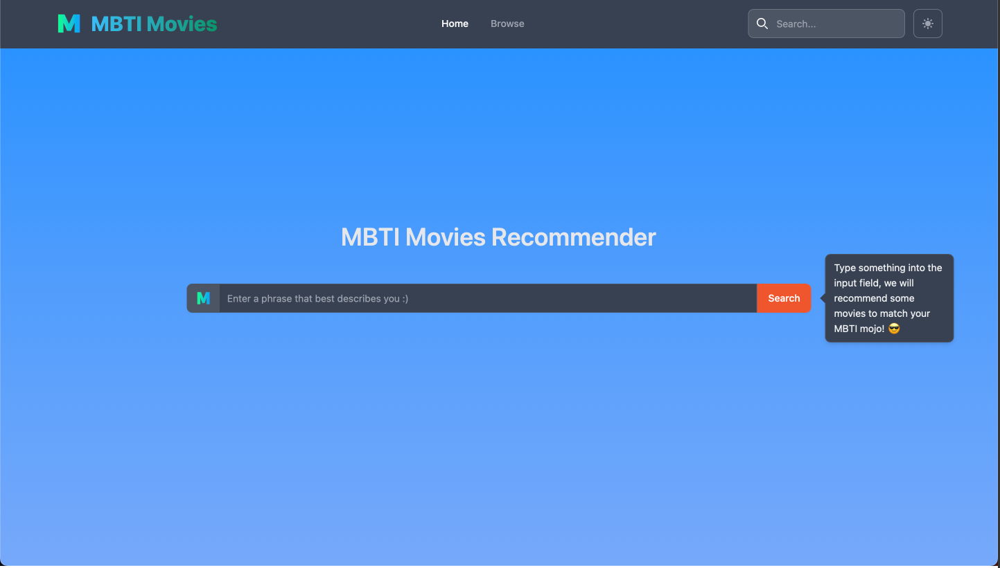
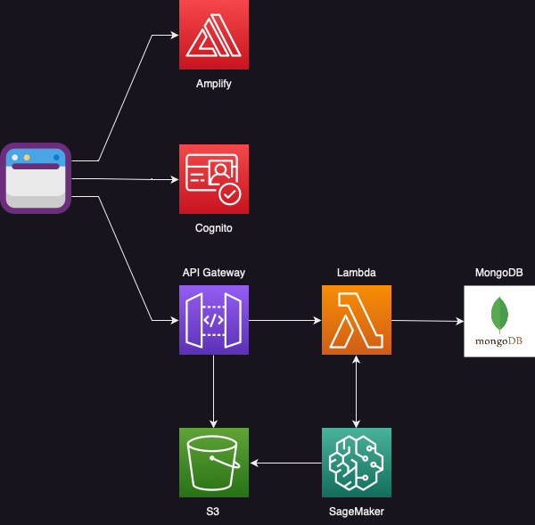

# MBTI Movie Recommender

## About
A full-stack serverless web application that recommends movies to users based on their predicted MBTI personality indicators.

## Technologies (Original Idea)
Frontend: TS, Svelte + SvelteKit, TailwindCSS, Flowbite UI Library, AWS amplify

API: API Gateway

Backend: Lambda Functions, MongoDB and SageMaker to run ML models

 

> Not a full accurate picture of current setup

## Current Setup

Hosting: Deployed to Vercel CDN 

Frontend: TS, Svelte + SvelteKit, TailwindCSS, Flowbite UI Library, Amplify SDK

API: Appsync Graphql API

Backend: MongoDB, Cognito Userpools, Identity Pools

> Will still have to develop the next steps of integrating the ML model for making MTBI predictions into the project (MLOps), potentially using tools like `Lambda` and `Sagemaker` to make it work

